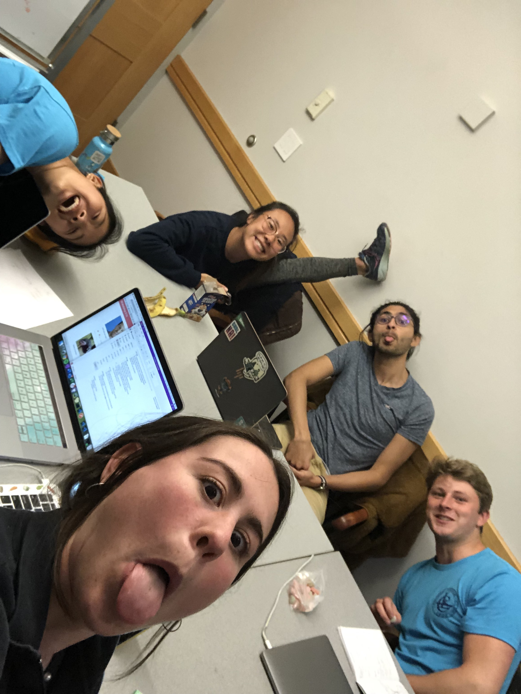

# Timeline

Timeline helps you know what you don't know... way before 

Sign up now (warning, Timeline may manifest itself as Free Food @Now but we promise it's not hehehe).

[Team Figma -- Mockups](https://www.figma.com/files/project/2496184/Timeline---Journey---Design-Your-Life)

## Architecture

Code is organized based on lab 4 frontend (some lab 5 stuff) right now.

Code library is based on Lab 4/5.

## Setup

Just `yarn` as of now! :) Yarn life.

## Deployment
heroku git: https://git.heroku.com/timimeline.git
heroku domain: https://timimeline.herokuapp.com/

To deploy the project, git clone both repos onto your local dev environment. Change the deploy URL in package.json to another surge URL and hit that `yarn deploy`.

## Authors

Abhimanyu Kapur '21

Katie Goldstein '20

Regina Yan '19

Sheppard Somers '19

Zoe Yu '19

## Sources

We started this project with Regina's Lab 4 (front end) and Abhimanyu's Lab 5 (server).

## Acknowledgments

Our lovely TA's
Timmy Tim Tim (Tim)
